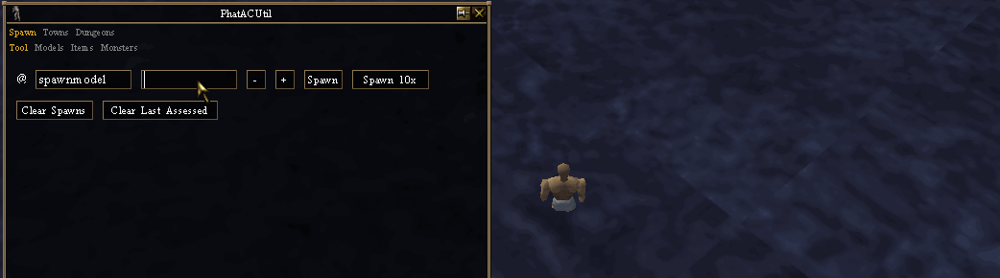

# PhatACUtil

A [Decal](http://www.decaldev.com) utility plugin for working with private Asheron's Call emulation servers such as PhatAC.

## Features

- Search and spawn models

- Automate executing @ commands and going through entity ids

- Search and teleport to towns instantly by name (via `@teletown`)

## Installing

See the [Releases](https://github.com/amoeba/PhatACUtil/releases) for the latest release. Install as you normally would for any Decal plugin distributed as a DLL.

## Bugs / Feature Requests / Suggestions / etc

Please submit bugs, feautre requests, or suggestions as Issues on this repository or find me on Discord as Petridish.